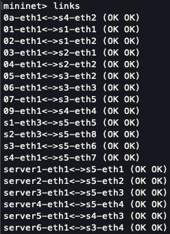

# Dynamic Network Slicing (DNS) for a Smart City 

This project has been developed for the Softwarized and Virtualized Mobile Networks course by:  
* Nicola Conti - Matricola: 218098
* Matteo Bertoldo - Matricola: 218184
* Federico Iop - Matricola: 218598  


## Introduction  
This project revolves around constructing an SDN (Software-Defined Networking) for a smart city by implementing a virtual network using the combined frameworks of Ryu and Mininet.  

The network topology has five distinct slices:  
1. Security
2. Smart traffic
3. IoT
4. Public Internet
5. Connecting

The first four slices are connected to the connecting slice, which houses the servers for each respective slice. For instance, Server 1 is dedicated to the Slice 1 - Security. The connecting slice serves as a bridge between the slices and their respective servers.  

Furthermore, the connecting slice facilitates communication between the webcams in Slice 1 and the routers in Slice 4. To ensure a rapid connection between Seismic Sensors (05) and Water Level Sensors (06) with the Public Alert Sirens (02), the UDP protocol is employed. This setup ensures prompt activation of the sirens in emergency situations.  


## The topology


## Setting up the network   
To set up the network, follow these commands:  
1. From the comnetsemu repository, initiate and log into the virtual machine by running:  
```
vagrant up comnetsemu
vagrant ssh comnetsemu
```

2. Execute the script to activate the RYU controllers and load the application:
```
./slice_setup.sh
```

3. Open a second terminal and run the following command to start mininet and create the network's topology:
```
sudo python3 topology.py
```


## Testing the network  
1. We can verify the correct creation of the network topology by using the following command in the mininet console:
```
mininet> links
```
  


2. To view the ports of every switch, execute the following command in the mininet console:
```
mininet> ports
```
 


3. To view every network's nodes, execute the following command in the mininet console:
```
mininet> nodes
```
  


4. To conduct a ping reachability test, enter the following command in the mininet console:
```
mininet> pingall
```
  

The ping reachibility test follows these constraints:  
* Servers within the communication slice can communicate with each other.  
* Each host in the respective slice can communicate with the server using the same slice number. For example, hosts in slice 2 can communicate with server 2.  
* The Webcams host (01) can communicate with routers in slice 4.  
* The Seismic Sensor (05) and River Water Level Sensor (06) can communicate with Public Alert Sirens (02) for security-related purposes.

5. test da 03 a server 3
6. da 09 a 01
7. da 05 a 02 (UDP test)
8. da 03 a 04, intraslice

