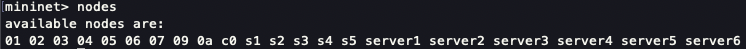

# Dynamic Network Slicing (DNS) for a Smart City (da rivedere il titolo)

This project has been developed for the Softwarized and Virtualized Mobile Networks course by:  
* Nicola Conti - Matricola:  
* Matteo Bertoldo - Matricola:  
* Federico Iop - Matricola: 218598  


## Introduction  
This project revolves around constructing an SDN (Software-Defined Networking) for a smart city by implementing a virtual network using the combined frameworks of Ryu and Mininet.  

The network topology has five distinct slices:  
1. Security
2. Smart traffic
3. IoT
4. Public Internet
5. Connecting

The first four slices are connected to the connecting slice, which houses the servers for each respective slice. For instance, Server 1 is dedicated to the Slice 1 - Security. The connecting slice serves as a bridge between the slices and their respective servers.  

Furthermore, the connecting slice facilitates communication between the webcams in Slice 1 and the routers in Slice 4. Switch 5 in the network is employed to establish a direct link between sismic sensors and water level sensors with the sirens (UDP?). This setup ensures prompt activation of the sirens in emergency situations.  

CONTROLLO UDP E SCRIVO CHE COMUNICANO CON PROTOCOLLO TCPIP


## The topology


## Setting up the network   
To set up the network, follow these commands:  
1. From the comnetsemu repository, initiate and log into the virtual machine by running:  
```
vagrant up comnetsemu
vagrant ssh comnetsemu
```

2. Execute the script to activate the RYU controllers and load the application:
```
./slice_setup.sh
```

3. Open a second terminal and run the following command to start mininet and create the network's topology:
```
sudo python3 topology.py
```


## Testing the network  
1. We can verify the correct creation of the network topology by using the following command in the mininet console:
```
mininet> links
```
  


2. To view the ports of every switch, execute the following command in the mininet console:
```
mininet> ports
```
 


3. To view every network's nodes, execute the following command in the mininet console:
```
mininet> nodes
```
  


4. To conduct a ping reachability test, enter the following command in the mininet console:
```
mininet> pingall
```
IMMAGINE  
The ping reachibility test follows these constraints:  
* Servers within the communication slice can communicate with each other.  
* Each host in the respective slice can communicate with the server using the same slice number. For example, hosts in slice 2 can communicate with server 2.  
* The Webcams host (01) can communicate with routers in slice 4.  
* The Seismic Sensor (05) and River Water Level Sensor (06) can communicate with Public Alert Sirens (02) for security-related purposes.


LA MIA IDEA E' SIMULARE UN DYNAMIC NETWORK SLICING (DNS) PER UNA CITTA' SMART

UNA RETE IN CUI CI SONO VARIE SLICE: WIFI PUBBLICO, SICUREZZA, TRAFFICO SMART, IOT E UNA SLICE CHE INTERCONNETTE QUESTE 4
OGNI SLICE HA UNO SWITCH E DUE HOST

SLICE --> perchè ogni rete separata ha diverse politiche di QoS (banda, priorità, connessioni usate ...)
HOST --> hanno tutti una funzione (elaborano traffico, termostati, stazioni meteo ...)

SLICE interconnesse perchè possono condividere la banda in caso di emergenza
possono essere spente/accese in caso di eventi
NON SO SE SERVONO I SERVER, INTANTO GLI HO MESSI

Obiettivi del Progetto:
L'obiettivo principale del progetto è creare una rete dinamica di slicing (DNS) per una città smart.
La rete deve essere in grado di fornire connettività e servizi diversificati a diverse parti della città, ciascuna con esigenze di QoS specifiche.

Casi d'Uso:
Scenari d'uso includono situazioni di emergenza, eventi speciali come fiere o manifestazioni, gestione del traffico durante le ore di punta, monitoraggio IoT in tempo reale e sicurezza della rete.

Architettura di Rete:
L'architettura di rete prevede cinque slice separate, ciascuna con un proprio switch, proprio server e due host.
Una slice di comunicazione interconnette le altre quattro slice per consentire la condivisione della banda in caso di necessità.

Politiche di QoS:
WiFi pubblico: Banda larga e priorità media.
Sicurezza: Banda media e priorità alta.
Traffico smart: Banda elevata e priorità media.
IoT: Banda bassa e priorità bassa.
Gestione delle Risorse:

In situazioni di emergenza, la slice di sicurezza ha la massima priorità e può richiedere più banda alle altre slice.
La banda viene condivisa in modo dinamico e in base alle esigenze, garantendo comunque un minimo livello di servizio per ciascuna slice.

Amministrazione e Controllo:
L'amministratore di rete ha il potere di accendere/spegnere le slice in base alle esigenze.
Le priorità vengono gestite automaticamente in base alle politiche di QoS e alle condizioni della rete.

Simulazioni e Test:
Sono stati condotti test di simulazione per verificare la risposta della rete in situazioni di emergenza e sovraccarico.
I risultati dimostrano che la rete è in grado di adeguare la banda in modo efficiente e garantire il funzionamento delle slice prioritarie.

Benefici e Applicazioni:
La rete dinamica di slicing migliora la gestione del traffico, la sicurezza e l'efficienza nell'erogazione di servizi in una città smart.
Applicazioni includono il monitoraggio del traffico in tempo reale, la gestione degli eventi speciali e la risposta alle emergenze.


Conclusioni:
Il progetto ha creato con successo una rete dinamica di slicing per una città smart, migliorando la qualità dei servizi offerti e la gestione delle risorse di rete.
